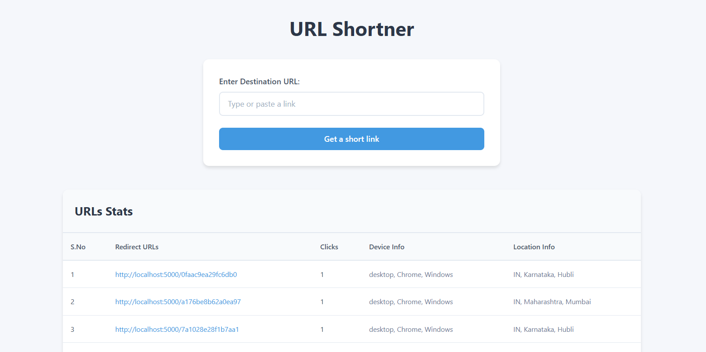

# Advanced Short URL Generator

## Overview
An advanced URL shortener built with **Node.js**, **Express.js**, and **MongoDB**, featuring user authentication, role-based access control, and detailed analytics on URL visits.



## Features
- **User Authentication**: Signup and login system with role-based access control (Admin/User).
- **Short URL Generation**: Authenticated users can create short URLs.
- **Visit Tracking**: Logs user clicks, including:
  - Country
  - Browser type
  - Device info
- **Admin Panel**: View and manage all short URLs and analytics.
- **EJS Templating**: Server-side rendering using EJS.

## Tech Stack
- **Backend**: Node.js, Express.js
- **Database**: MongoDB (Mongoose ODM)
- **Authentication**: JWT (JSON Web Token)
- **View Engine**: EJS

## Installation
### 1. Clone the Repository
```sh
git clone https://github.com/your-username/shortifynow.git
cd shortifynow
```

### 2. Install Dependencies
```sh
npm install
```

### 3. Configure Environment Variables
Create a `.env` file in the root directory and add the following:
```env
PORT=5000
MONGO_URI=your_mongodb_connection_string
```

### 4. Run the Server
```sh
npm start
```
The server will start at `http://localhost:5000`

## API Endpoints
### Authentication
- `POST /user/signup` - Register a new user
- `POST /user/login` - Login and get a JWT token

### Short URL Management
- `POST /` - Generate a short URL (Authenticated users only)
- `GET /:shortId` - Redirect to the original URL and log visit details
- `GET /analytics/:shortId` - View analytics for a short URL (Admin access required)

## Contributing
Pull requests are welcome! Open an issue for feature requests or bug reports.

## License
This project is licensed under the [MIT License](LICENSE).

