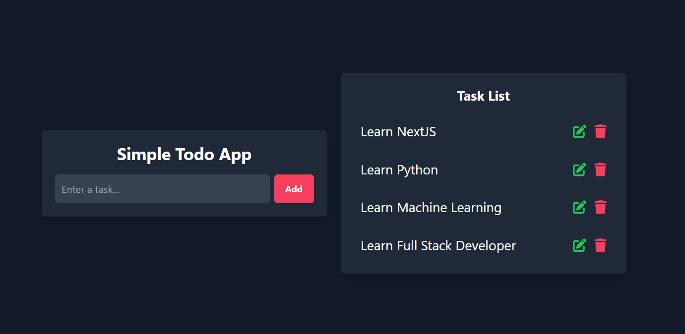

# Todo App (Node.js + MongoDB + TailwindCSS)

A simple and elegant **Todo App** built with **Node.js**, **MongoDB**, and a frontend using **HTML, CSS, JavaScript, and TailwindCSS**. This app allows users to add, update, and delete tasks efficiently.

## Features
- ✅ Add new tasks
- ✏️ Edit existing tasks
- ❌ Delete tasks
- 🎨 Responsive UI with TailwindCSS
- 🗄️ Data persistence using MongoDB

## Tech Stack
- **Backend:** Node.js
- **Database:** MongoDB
- **Frontend:** HTML, CSS, JavaScript, TailwindCSS

## Contributing
Contributions are welcome! Feel free to fork, create a branch, and submit a PR.

## License
This project is licensed under the MIT License.

---
🚀 Happy Coding!
